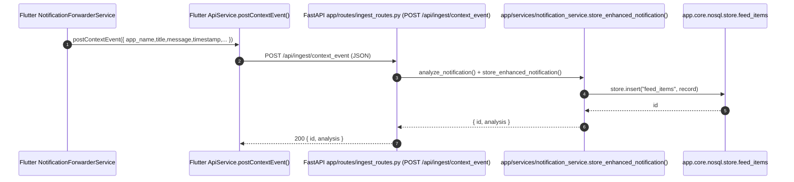
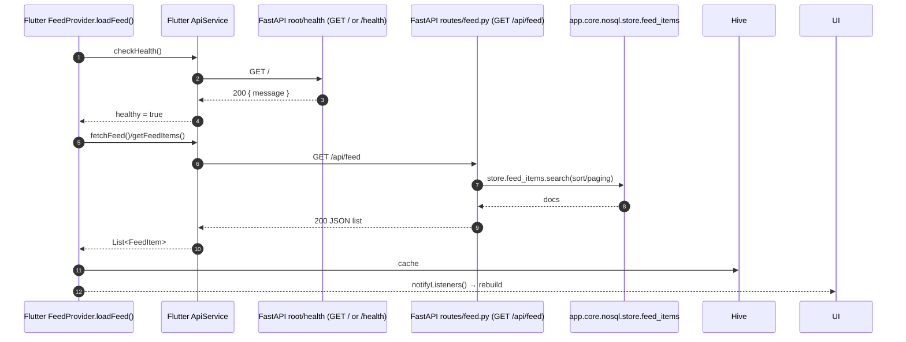
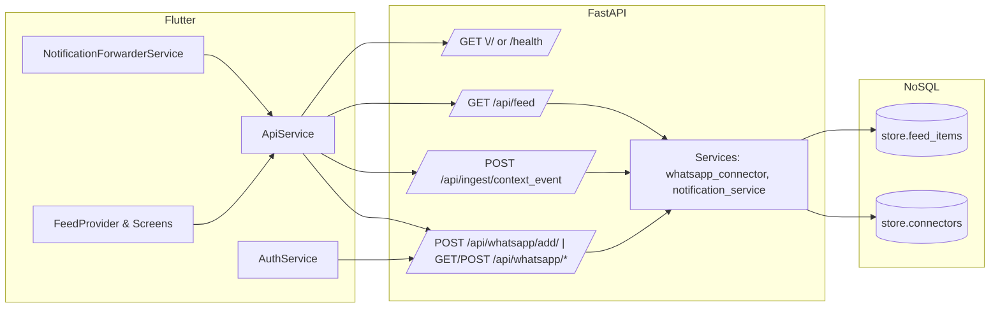

## Backend Architecture Report (NoSQL / Hive-backed)

This report documents the current backend in `flutter_backend/` after migrating to a Hive-like NoSQL store (`app/core/nosql.py`). All relational SQL/SQLAlchemy code has been removed from the active flows documented here. Gmail-related routes and processing are paused and are not included below.

Active applications and areas:

- `flutter_backend/app/main.py`: Minimal FastAPI app focused on health, user/profile, and notification ingestion. Now writes to NoSQL `store.feed_items`.
- `flutter_backend/routes/whatsapp.py`: WhatsApp ingestion endpoints using the NoSQL store for persistence and duplicate handling.
- `flutter_backend/app/core/nosql.py`: NoSQL store (TinyDB or in-memory fallback) with collections: `users`, `feed_items`, `tasks`, `connectors`, `vector_meta`.
- `flutter_backend/services/whatsapp_connector.py`: Parsing, enrichment (LLM), and storage of WhatsApp messages/feed items. Uses NoSQL `store.feed_items` for persistence.
- `flutter_backend/app/services/notification_service.py`: Persists enhanced notifications to NoSQL `store.feed_items`.

Legacy/paused areas not covered in this report: Gmail connectors and routes, SQLAlchemy database models/sessions.

---

### 1) API Endpoints

Below is the current surface for active endpoints. Endpoints are grouped by module.

#### A) App: `flutter_backend/app/`

- `GET /` (in `app/main.py`)
  - Purpose: Health message.
  - Input: None.
  - Output: `{ "message": string }`.
  - Errors: None.
  - Store interaction: None.
  - Input: none
  - Output JSON: `{ "status": "ok" }`
  - Validation: none
  - Module: `app/routes/health_routes.py`

- POST `/api/ingest/context_event`
  - Purpose: Ingest a generic mobile notification, analyze via LLM, persist enriched record
  - Input JSON (Pydantic `NotificationModel` in `app/models/notification_model.py`):
    - Required: `app_name: string`, `message: string`, `timestamp: string(ISO8601)`
    - Optional: `title: string`, `priority: number [0.0..1.0]`, `category: string`
  - Output JSON: `{ id: number, analysis: { is_relevant: bool, priority: number, category: string, summary: string } }`
  - Validation rules:
    - `app_name` min length 1
    - `message` min length 1
    - `priority` if present must be within [0.0, 1.0]
  - Modules: `app/routes/ingest_routes.py` calls `app/services/llm_service.analyze_notification` then `app/services/notification_service.store_enhanced_notification`

- GET `/api/user/profile`
  - Purpose: Read the latest stored user profile (single-row table semantics)
  - Input: none
  - Output JSON: `{ "profile": null | { name: string, email: string, preferences: object, persona: object } }`
  - Validation: none
  - Module: `app/routes/user_routes.py` -> `app/core/database.get_user_profile`

- POST `/api/user/profile`
  - Purpose: Create or update the (single) user profile record
  - Input JSON (Pydantic `UserProfileModel`):
    - Required: `name: string`, `email: EmailStr`
    - Optional: `preferences: object`, `persona: object`
  - Output JSON: `{ id: number, status: "ok" }`
  - Validation: `email` must be a valid email
  - Module: `app/routes/user_routes.py` -> `app/core/database.upsert_user_profile`

- GET `/`
  - Purpose: Root welcome message
  - Output JSON: `{ "message": "Welcome to Personalized AI Companion Backend" }`

Notes on error handling for this app:
- `ingest_routes.py` returns HTTP 500 with `detail` if LLM or storage processing fails.
- `llm_service.analyze_notification` gracefully handles missing `GROQ_API_KEY` by returning a low-priority, `is_relevant=false` fallback analysis.

#### 1.2 Primary app (file: `flutter_backend/main.py`, most routers included under prefix `/api`)

- GET `/`
  - Purpose: Root welcome message
  - Output: `{ "message": "Welcome to Personal AI Feed Backend!" }`

- GET `/health`
  - Purpose: Container/instance health check
  - Output: `{ "status": "ok" }`

- GET `/api/feed` (module: `routes/feed.py`)
  - Purpose: Return combined list of DB feed items + mock data + live news
  - Input: none
  - Output: `List<FeedItem>` (API model from `routes/feed.py`), fields include: `id, title, summary, content, full_text, date, source, priority, relevance, metaData`
  - Validation: none; server applies conversions and defaults

- POST `/api/extract_tasks` (module: `routes/tasks.py`)
  - Purpose: Extract actionable tasks from provided text via LLM adapter
  - Input JSON `ExtractTasksRequest`: `{ text: string (required, non-empty) }`
  - Output JSON `ExtractTasksResponse`: `{ summary: string, tasks: [{ verb: string, due_date: string|null, text: string }] }`
  - Validation: `text` must be non-empty; HTTP 400 if empty

- Search (module: `routes/search.py`)
  - POST `/api/search`
    - Purpose: Semantic search over user feed items via vector store
    - Input `SearchRequest`: `{ query: string, top_k?: int(1..100), threshold?: float(0.0..1.0), source_filter?: string }`
    - Output `SearchResponse`: `{ query: string, results: [SearchResult], total_found: int, search_time_ms: float }`, where `SearchResult` includes: `id, title, summary?, source, date, priority, relevance_score, similarity_score, entities[], has_tasks`
    - Validation: empty query -> 400; top_k out of range -> 400; threshold out of range -> 400
  - GET `/api/search/suggestions?query=<str>&limit=<1..20>`
    - Purpose: Suggest queries/titles based on recent items
    - Output: `{ suggestions: [{ text, source, date }] }`
  - GET `/api/search/stats`
    - Purpose: DB and vector index stats
    - Output: `{ database: {...}, vector_store: {...}, embeddings: {...} }`
  - POST `/api/search/rebuild-index`
    - Purpose: Rebuild vector index
    - Output: `{ message: "Vector index rebuilt successfully" }`

- Feedback & Profile (module: `routes/feedback.py`)
  - POST `/api/feedback`
    - Purpose: Record user feedback for a feed item
    - Input `FeedbackRequest`: `{ feed_item_id: int, feedback_type: enum, feedback_value?: float(0..1), context?: object }`
    - Output `FeedbackResponse`: `{ success: bool, message: string, updated_ranking?: bool }`
    - Validation: `feedback_type` ∈ {like, dislike, complete, snooze, dismiss}; `feedback_value` if present must be in [0,1]
  - GET `/api/feedback/history?limit=&feedback_type=`
    - Purpose: Retrieve recent feedback history
    - Output: `{ feedback_history: [{ id, feed_item_id, feedback_type, feedback_value, context, created_at }], total_count: int }`
  - GET `/api/profile`
    - Purpose: Get user personalization profile (SQLAlchemy layer)
    - Output `UserProfileResponse`: fields include `important_keywords[], important_contacts[], preferred_sources[], local_only_mode: bool, allow_llm_processing: bool, ranking_weights: object, feedback_count: int`
  - PUT `/api/profile`
    - Purpose: Update parts of the profile (`UpdateProfileRequest`)
    - Validation: `ranking_weights` keys must be subset of allowed keys; lengths: keywords ≤ 50, contacts ≤ 20
  - DELETE `/api/profile/reset`
    - Purpose: Reset profile to defaults
  - GET `/api/ranking/weights`
    - Purpose: Return default ranking weights and descriptions

- Gmail (module: `routes/gmail.py`)
  - GET `/api/auth/gmail/url?user_id=` -> `{ auth_url, state }`
  - POST `/api/auth/gmail/callback` with `{ code, state }`
  - GET `/api/gmail/status` -> `GmailStatusResponse { connected, email?, last_sync?, total_emails }`
  - POST `/api/gmail/fetch` with `{ max_results?, since_hours? }` (background)
  - GET `/api/gmail/emails?limit&offset` -> `{ emails: [...], total_count, limit, offset }`
  - DELETE `/api/gmail/disconnect`
  - Validation & errors: Ensures connector configured and tokens present; uses 400 for not configured, 500 for processing errors

- News (module: `routes/news.py`)
  - GET `/api/news/status` -> `NewsStatusResponse { rss_feeds_configured, newsapi_available, gnews_available, total_articles, last_sync? }`
  - POST `/api/news/fetch` with `{ sources?: ["rss"|"newsapi"|"gnews"], max_results?: int, query?: string }` (background)
  - GET `/api/news/articles?limit&offset&category?` -> `{ articles: [...], total_count, limit, offset }`
  - GET `/api/news/sources` -> configured defaults and API availability
  - POST `/api/news/sources/rss` with `{ name, url, category }`
  - DELETE `/api/news/sources/rss/{feed_url}`

- Reddit (module: `routes/reddit.py`)
  - GET `/api/reddit/status` -> `RedditStatusResponse { connected, configured_subreddits[], total_posts, last_sync? }`
  - POST `/api/reddit/fetch` with `{ subreddits?, max_posts_per_subreddit?, time_filter? }` (background)
  - GET `/api/reddit/posts?limit&offset&subreddit?`
  - GET `/api/reddit/subreddits` -> default lists and categories
  - POST `/api/reddit/subreddits` with `List[str]` (max 20)
  - GET `/api/reddit/popular?subreddit&limit`

- Jobs (module: `routes/jobs.py`)
  - POST `/api/jobs/create` with `{ job_type, user_id, payload?, priority? }`
  - GET `/api/jobs/{job_id}`
  - GET `/api/jobs/user/{user_id}?limit`
  - DELETE `/api/jobs/{job_id}`
  - POST `/api/jobs/sync/gmail` | `/api/jobs/sync/news` | `/api/jobs/sync/reddit` (triggers connector-specific sync jobs)
  - GET `/api/jobs/stats`

- Context ingestion (module: `routes/context_ingest.py`, app-level prefix `/api` applied)
  - POST `/api/ingest/context_event`
    - Purpose: Accept context events from mobile (notification/accessibility)
    - Input `ContextEvent`:
      - Required: `user_id: string`, `package: string`, `source: enum("notification"|"accessibility")`
      - Optional: `title?: string`, `text?: string`, `timestamp?: int (epoch ms)`, `meta?: object`, `user_opt_in_raw?: bool`, `local_only?: bool`, `sender?: string`, `event_id?: string`
    - Output: whatever `services.context_processor.process_context_event` returns (feed item creation + embeddings etc.)

- WhatsApp (module: `routes/whatsapp.py`)
  - POST `/api/whatsapp/export` (multipart file + JSON body `{ chat_name, user_id }`) -> starts background parsing and indexing
  - POST `/api/whatsapp/add` with `{ sender, message, timestamp(ms), user_id }` -> background processing
  - POST `/api/whatsapp/notification` with `{ title, content, sender?, timestamp?, user_id }` -> background processing
  - GET `/api/whatsapp/status?user_id=` -> `WhatsAppStatus { enabled, last_sync?, total_messages, last_24h_messages }`
  - POST `/api/whatsapp/enable|disable` with `user_id`
  - GET `/api/whatsapp/messages?user_id=&limit=&offset=`
  - DELETE `/api/whatsapp/messages/{message_id}?user_id=`

- Telegram (module: `routes/telegram.py`)
  - GET `/api/telegram/bot/info`
  - POST `/api/telegram/configure` with `{ bot_token, user_id }`
  - GET `/api/telegram/status?user_id=` -> `TelegramStatus { enabled, last_sync?, total_messages, last_24h_messages, bot_username? }`
  - POST `/api/telegram/fetch?user_id=&limit=` -> background fetching
  - POST `/api/telegram/enable|disable` with `user_id`
  - GET `/api/telegram/messages?user_id=&limit=&offset=`
  - POST `/api/telegram/send` with `chat_id, text`

- Instagram (module: `routes/instagram.py`)
  - GET `/api/instagram/auth/url?user_id=`
  - POST `/api/instagram/auth/callback` with `{ code, state }`
  - GET `/api/instagram/status?user_id=` -> `InstagramStatus { enabled, last_sync?, total_posts, last_24h_posts, username? }`
  - POST `/api/instagram/fetch?user_id=&limit=` -> background fetching
  - POST `/api/instagram/enable|disable` with `user_id`
  - GET `/api/instagram/posts?user_id=&limit=&offset=`

- Calendar & Notifications (module: `routes/calendar.py`)
  - GET `/api/calendar/auth/url?user_id=` -> `{ auth_url, user_id }`
  - POST `/api/calendar/auth/callback` with `{ code, state }` (stores tokens)
  - GET `/api/calendar/status?user_id=` -> `CalendarStatus { enabled, last_sync?, total_events, upcoming_events }`
  - POST `/api/calendar/sync/task/{task_id}?user_id=` -> sync task to Google Calendar
  - DELETE `/api/calendar/unsync/task/{task_id}?user_id=`
  - GET `/api/calendar/events?user_id=&days_ahead=` -> `{ events: [...], total }`
  - Notifications sub-group:
    - GET `/api/notifications/upcoming?user_id=&hours_ahead=`
    - POST `/api/notifications/schedule/task/{task_id}?user_id=`
    - DELETE `/api/notifications/cancel/task/{task_id}?user_id=`
    - POST `/api/notifications/send` with `user_id, title, body, priority?`

Validation summary (primary app): request models enforce types; additional runtime checks include value ranges (e.g., search `top_k`, thresholds), required connector configuration, and presence of OAuth tokens.

---

### 2) Service/Module Responsibilities

- Ingestion (minimal app)
  - `app/services/llm_service.py`: Calls Groq chat completions; if no key or failure, returns fallback analysis. Depends on `app/core/config.settings.groq_api_key` and `requests`.
  - `app/services/notification_service.py`: Maps original notification + LLM analysis to DB record; writes via `app/core/database.insert_notification`.

- Context ingestion (primary app)
  - `services/context_processor.process_context_event`: 
    - Determines local-only behavior based on `event.local_only` and privacy settings; builds normalized metadata; optionally calls `ml/llm_adapter` to summarize, extract tasks, embed; stores to SQLAlchemy models and vector store.
    - Dependencies: `ml/llm_adapter`, `storage.vector_store`, `services.ranking`.

- Connectors
  - Gmail: `services/gmail_connector.py` provides OAuth URL, callback handling, fetching emails, transforming to `FeedItem`, and saving.
  - News: `services/news_connector.py` fetches RSS/NewsAPI/GNews, transforms to `FeedItem`, persists, and updates `ConnectorConfig` last sync.
  - Reddit: `services/reddit_connector.py` handles API client, fetches subreddit posts, transforms to `FeedItem`, persists, updates `ConnectorConfig`.
  - WhatsApp: `services/whatsapp_connector.py` parses chat exports and processes notifications/messages; generates embeddings; saves via vector store.
  - Telegram: `services/telegram_connector.py` wraps bot calls, fetches updates, processes messages to `FeedItem`, saves with embeddings.
  - Instagram: `services/instagram_connector.py` handles OAuth, fetches media, processes to `FeedItem`, saves with embeddings.
  - Calendar: `services/calendar_service.py` provides OAuth URL generation, token exchange, event sync/unsync, and event retrieval.

- Search and Ranking
  - `storage/vector_store.py`: Index, search, rebuild operations; stores/retrieves embeddings and similarity metadata.
  - `services/ranking.py`: Ranking service with weighted factors and feedback learning; provides updates to user profile based on feedback.

- Feedback & Personalization
  - `routes/feedback.py` orchestrates feedback recording and user profile updates via `services.ranking` and SQLAlchemy models.

- Background Jobs
  - `services/background_jobs.py`: Job types (`GMAIL_SYNC`, `NEWS_SYNC`, `REDDIT_SYNC`, `CLEANUP_OLD_DATA`), job queue, background worker orchestration.
  - `routes/jobs.py`: Job management endpoints.

Database operations and async/background work:
- Many connector endpoints enqueue background tasks using `BackgroundTasks` (FastAPI) that call service methods which perform DB writes and embeddings.
- `flutter_backend/main.py` `startup_event` initializes DB and starts a background worker (`services.background_jobs.start_background_worker`).

---

### 3) Database Structure

There are two persistence layers present:

1) Minimal app SQLite (file: `app/core/database.py`, file path `personalized_ai_companion.db`)
   - Table `user_profile`:
     - `id INTEGER PK AUTOINCREMENT`
     - `name TEXT`, `email TEXT`, `preferences_json TEXT`, `persona_json TEXT`
   - Table `notifications`:
     - `id INTEGER PK AUTOINCREMENT`
     - `app_name TEXT NOT NULL`, `title TEXT`, `message TEXT NOT NULL`, `timestamp TEXT NOT NULL (ISO8601)`, `priority REAL`, `category TEXT`, `is_relevant INTEGER`, `summary TEXT`
   - Used by endpoints in `app/routes/user_routes.py` and `app/routes/ingest_routes.py`.

2) Primary app SQLAlchemy models (file: `storage/models.py`, default DB URL `sqlite:///./personalized_ai_feed.db`)
   - `users` (`User`): `id PK`, `email (unique)`, `name`, `is_active`, `is_admin`, `created_at`, `updated_at`
   - `user_profiles` (`UserProfile`): `id PK`, `user_id FK users.id`, personalization arrays and flags: `important_keywords[]`, `important_contacts[]`, `preferred_sources[]`, `feedback_history[]`, `local_only_mode: bool`, `allow_llm_processing: bool`, `ranking_weights: object`, timestamps
   - `feed_items` (`FeedItem`):
     - `id PK`, `user_id FK users.id`
     - `source ENUM(SourceType)`, `origin_id STRING`, `title`, `summary`, `text`
     - `date DateTime`, `priority ENUM(PriorityLevel)`, `relevance_score Float`
     - `entities []`, `metadata JSON` (mapped as `meta_data`), `has_tasks bool`, `extracted_tasks []`
     - `embedding JSON`, `is_encrypted bool`, `processed_locally bool`, timestamps
   - `tasks` (`Task`): task fields, status, calendar sync fields (including `task_meta` JSON), timestamps
   - `connector_configs` (`ConnectorConfig`): connector type enum, `is_enabled`, OAuth tokens, `config_data JSON`, `last_sync_at`, `sync_frequency_minutes`, timestamps
   - `feedback` (`Feedback`): `user_id`, `feed_item_id`, `feedback_type`, `feedback_value`, `context JSON`, `created_at`
   - `search_history` (`SearchHistory`): `user_id`, `query`, `results_count`, `clicked_results []`, `created_at`

Relationships:
- `User` 1—1 `UserProfile`
- `User` 1—N `FeedItem`, `Task`, `ConnectorConfig`, `Feedback`, `SearchHistory`
- `FeedItem` 1—N `Task`

Endpoint table access mapping (primary app):
- `routes/feed.py` reads `feed_items`
- `routes/search.py` reads `feed_items` and uses `vector_store`
- `routes/feedback.py` reads/writes `feedback`, reads/creates `user_profiles`, reads `feed_items`
- `routes/gmail.py`, `routes/news.py`, `routes/reddit.py`, `routes/instagram.py`, `routes/telegram.py`, `routes/whatsapp.py` write `feed_items`, update `connector_configs`; also read for list/status endpoints
- `routes/calendar.py` reads `tasks`, updates `connector_configs`; notification settings handled via `services.notification_service` (see below)

---

### 4) Data Flow Mapping

Representative flows:

- `/api/ingest/context_event` (minimal app)
  - Request (NotificationModel) -> `services.llm_service.analyze_notification` (Groq or fallback) -> `services.notification_service.store_enhanced_notification` -> `core.database.insert_notification` -> Response `{ id, analysis }`.

- `/api/ingest/context_event` (primary app context route)
  - Request (ContextEvent) -> `services.context_processor.process_context_event`:
    - Normalize text and metadata
    - If not `local_only`, call `ml.llm_adapter` to summarize, extract tasks, and embed
    - Persist `FeedItem` (and possibly `Task`) via SQLAlchemy sessions
    - Add embeddings to `storage.vector_store`
  - Response: structured result with created items/ids (implementation dependent in service)

- `/api/search` -> `storage.vector_store.search` -> result items mapped to `SearchResponse` -> Response.

- Connector sync (e.g., `/api/gmail/fetch`, `/api/news/fetch`, `/api/reddit/fetch`):
  - Request enqueues background task -> service fetches from external API(s) -> transforms to `FeedItem` -> checks duplicates by `origin_id` -> persists -> updates `ConnectorConfig.last_sync_at` -> returns started message.

- Feedback (`/api/feedback`):
  - Request validated -> insert `Feedback` -> invoke `services.ranking.update_user_profile_from_feedback` (recomputes/adjusts personalization) -> Response success.

- Calendar sync (`/api/calendar/sync/task/{task_id}`):
  - Task loaded -> `services.calendar_service.sync_task_to_calendar` (uses OAuth credentials) -> returns event id.

Transformations/sanitization/LLM involvement:
- `llm_service` and `ml/llm_adapter` enforce JSON outputs and provide fallbacks; text cleaning and entity extraction occur in connectors and utilities (e.g., `utils.string_utils`).
- Enums are converted to strings for API responses where needed.
- Several routes guard against empty strings, out-of-range parameters, and missing OAuth credentials.

---

### 5) External Integrations

- Groq API (app `llm_service`): `https://api.groq.com/openai/v1/chat/completions`
  - API key env: `GROQ_API_KEY` (minimal app uses `app/core/config.settings.groq_api_key`; primary app logs presence at startup)
  - Missing key handling: returns fallback analysis (not erroring)

- News APIs: RSS feeds, NewsAPI.org (`NEWSAPI_KEY`), GNews (`GNEWS_API_KEY`)
  - Missing keys: features disabled gracefully; status endpoints reflect availability

- Gmail: OAuth2 (client configuration via connector service; tokens stored in `connector_configs`)
  - If not authenticated: endpoints return 400 with guidance

- Reddit: API client requires `REDDIT_CLIENT_ID` and `REDDIT_CLIENT_SECRET`
  - Missing keys: fetch endpoints return 400; status shows `connected=false`

- Telegram Bot: `TELEGRAM_BOT_TOKEN`
  - Configuration validated via `getMe`; token stored in `connector_configs.config_data`

- Instagram: OAuth with app credentials and redirect URI envs; access tokens stored in `connector_configs`

- Google Calendar: `GOOGLE_CALENDAR_CLIENT_ID`, redirect URI `GOOGLE_CALENDAR_REDIRECT_URI`
  - Token exchange performed; tokens persisted in `connector_configs`

- Embeddings/Vector Store: `storage/vector_store` provides an in-process index; embeddings via `nlp.embeddings`

Error/Key handling patterns:
- Most connectors check for configuration and return 400 if not enabled or tokens missing; background tasks log errors and continue.

---

### 6) Constraints and Assumptions

- Parameter limits:
  - Search: `top_k` in [1, 100]; `threshold` in [0.0, 1.0]
  - Suggestions: `limit` in [1, 20]
  - Various list endpoints: typical `limit` ranges 1..100
  - Feedback: `feedback_value` in [0.0, 1.0]
  - Profile updates: `important_keywords` ≤ 50 items; `important_contacts` ≤ 20 items

- Privacy toggles:
  - `user_profiles.local_only_mode` (profile-level) and `ContextEvent.local_only` (request-level override)
  - `user_profiles.allow_llm_processing` governs whether LLM calls are permitted
  - `ContextEvent.user_opt_in_raw` indicates client opt-in to send raw content

- Data size assumptions:
  - Titles and summaries constrained by SQLAlchemy column sizes (e.g., `title` up to ~500 chars), long text fields use `Text`

- Fault tolerance:
  - Missing external API keys result in graceful degradation (status shows unavailability; actions may be skipped rather than failing the entire request)

---

### 7) UI Change Risks

- Hard dependencies:
  - Enum values for `source` and `priority` must remain consistent with `SourceType` and `PriorityLevel` for persistence and filtering.
  - `FeedItem.metadata` is stored as `meta_data` (aliased column name) in SQLAlchemy; mismatches between API JSON and DB mapping can break serialization assumptions.
  - OAuth callback contracts (`code`, `state`) must remain unchanged for Gmail/Instagram/Calendar flows.

- Potential breakage from UI changes:
  - Changing `search` parameter names or ranges will break server-side validation.
  - Feedback `feedback_type` must remain within the accepted set; altering the UI values requires server updates.
  - WhatsApp/Telegram/Instagram status/detail endpoints expect `user_id` query param; removing it in UI will cause 400/500s.

- Safer, optional fields:
  - Many response fields are optional (`summary`, `entities`, `extracted_tasks`, metadata subfields like `author`), and UI can omit displaying them without breaking backend.
  - Context events: `title`, `text`, `sender`, `event_id`, `meta` are optional.

---

### 8) Examples

- POST `/api/ingest/context_event` (minimal app)
```json
{
  "app_name": "Gmail",
  "title": "Assignment due",
  "message": "Your assignment is due next week",
  "timestamp": "2025-10-16T10:00:00Z",
  "priority": 0.7,
  "category": "School"
}
```
Response:
```json
{
  "id": 123,
  "analysis": {
    "is_relevant": true,
    "priority": 0.7,
    "category": "School",
    "summary": "Assignment due next week"
  }
}
```

- POST `/api/extract_tasks`
```json
{ "text": "Submit the assignment by Oct 15 and attend meeting tomorrow 2 PM" }
```
Response:
```json
{
  "summary": "Assignment due Oct 15 and meeting tomorrow",
  "tasks": [
    { "verb": "submit", "due_date": "2025-10-15", "text": "assignment by Oct 15" },
    { "verb": "attend", "due_date": null, "text": "meeting tomorrow 2 PM" }
  ]
}
```

- POST `/api/search`
```json
{ "query": "assignment due next week", "top_k": 5, "threshold": 0.3 }
```
Response (shape):
```json
{
  "query": "assignment due next week",
  "results": [
    {
      "id": 42,
      "title": "Assignment reminder",
      "summary": "",
      "source": "gmail",
      "date": "2025-10-10T12:34:56Z",
      "priority": "MEDIUM",
      "relevance_score": 0.83,
      "similarity_score": 0.76,
      "entities": [],
      "has_tasks": true
    }
  ],
  "total_found": 1,
  "search_time_ms": 23.5
}
```

- POST `/api/news/sources/rss`
```json
{ "name": "Hacker News", "url": "https://news.ycombinator.com/rss", "category": "technology" }
```

- POST `/api/reddit/subreddits`
```json
["programming", "MachineLearning", "technology"]
```

- GET `/api/gmail/status` example response
```json
{ "connected": true, "email": "user@example.com", "last_sync": "2025-10-15T15:04:05Z", "total_emails": 123 }
```

- Context ingestion (primary app) POST `/api/ingest/context_event`
```json
{
  "user_id": "1",
  "package": "com.whatsapp",
  "title": "New message",
  "text": "Let's meet at 2 pm",
  "timestamp": 1729075200000,
  "source": "notification",
  "meta": { "conversation": "Alice" },
  "user_opt_in_raw": true,
  "local_only": false
}
```

---

### Notes and Observations

- Two separate persistence layers exist side-by-side: a simple SQLite (row-level) DB in `app/core/database.py` and a full SQLAlchemy ORM in `storage/`. They serve different endpoint groups and databases. Keep this in mind for migrations and environment setup.
- Many routes assume a default `user_id=1` until authentication is implemented. Hard-coded user IDs should be revisited when auth is added.
- Several connector routes enqueue background tasks; clients should not expect immediate data but can poll status or listing endpoints.


## 🔁 End-to-End Data & API Flow (Frontend ↔ Backend)

### High-Level Overview

- **Transport & Methods**
  - Flutter uses `http` with JSON over HTTP(S): `GET`, `POST`, `DELETE`.
  - Headers: `Content-Type: application/json`, `Accept: application/json` (see `flutter_application_1/lib/config/api_config.dart` `defaultHeaders`).
  - Timeouts: 10s in Flutter (`ApiConfig.timeout`).

- **Frontend Callers**
  - `ApiService.checkHealth()`, `fetchFeed()`, `getFeedItems()`, `postContextEvent()`, `postWhatsAppMessage()`.
  - `AuthService.getConnectorStatus()`, `enableConnector()`, `disableConnector()` for WhatsApp status/toggles.
  - `NotificationForwarderService` uses native channels; when forwarding to server is enabled, it calls `postContextEvent()`.

- **Backend Receivers (FastAPI)**
  - Health/root: `GET /` (in `app/main.py` root) and/or `GET /health` (primary app), used by Flutter `checkHealth()`.
  - Feed: `GET /api/feed` (primary app), aggregates/returns items from NoSQL `store.feed_items`.
  - Notification ingestion: `POST /api/ingest/context_event` (minimal app) → `app/services/notification_service.store_enhanced_notification()` persists to `store.feed_items`.
  - WhatsApp ingestion and status: routes in `routes/whatsapp.py` use `app.core.nosql.store` for `feed_items` and `connectors` with `store.insert()`, `store.search()`, `store.upsert()`.

- **Store**
  - `app/core/nosql.py` provides in-memory/Hive-like store collections: `feed_items`, `connectors`, `users`, `tasks`, `vector_meta`.
  - Operations: `store.insert()`, `store.search()`, `store.upsert()` handle persistence and dedupe by keys.

- **Lifecycle Timing**
  - Frontend call (HTTP) → FastAPI route → Service → NoSQL store op → Response JSON → Flutter await → Provider/UI update.

---

### Flow Diagrams

#### WhatsApp Messages (`/api/whatsapp`)

```mermaid
sequenceDiagram
  autonumber
  participant FE as Flutter ApiService.postWhatsAppMessage()
  participant RT as FastAPI routes/whatsapp.py (POST /api/whatsapp/add)
  participant SV as services.whatsapp_connector
  participant ST as app.core.nosql.store.feed_items

  FE->>RT: POST /api/whatsapp/add { sender,message,timestamp,user_id }
  RT->>SV: process_message(payload)
  SV->>SV: summarize, extract tasks (LLM adapter if configured)
  SV->>ST: store.insert("feed_items", doc)
  ST-->>SV: id
  SV-->>RT: result { id }
  RT-->>FE: 200/202 { id }
  Note over RT,SV: No SQLAlchemy; NoSQL store handles persistence
```

- Backend path: `routes/whatsapp.py` → `services.whatsapp_connector` → `store.insert("feed_items")`.
- If connector toggles are used: `POST /api/whatsapp/enable|disable` → `store.upsert("connectors", cfg, key="user_id")`.
- Status fetch: `GET /api/whatsapp/status?user_id=` → `store.connectors.search(...)`, `store.feed_items.search(...)`.

#### Notification Ingestion (`/api/ingest/context_event`)



- Validation: `NotificationModel` in `app/routes/ingest_routes.py` requires `app_name`, `message`, `timestamp (ISO8601)`; optional fields: `title`, `priority`, `category`.
- Errors: LLM failure handled with fallback; storage failure returns 500 with `detail`.

#### Feed Fetching (`/api/feed`) and Health (`/` or `/health`)



---

### Detailed Step-by-Step Explanation

#### WhatsApp Flow
- Incoming request
  - Endpoint: `POST /api/whatsapp/add`.
  - Payload: `{ sender: string, message: string, timestamp: int(ms), user_id: int|string }`.
  - Validation: route-level checks (presence of fields); duplicates avoided upstream by `store.upsert` when used for updates and by id/keying in services.
- Routing & services
  - `routes/whatsapp.py` receives, calls `services.whatsapp_connector` for summarization/task extraction.
  - Persistence via `store.insert("feed_items", doc)`; status updates via `store.upsert("connectors", cfg, key="user_id")`.
- Async behavior
  - Handlers are `async def` where applicable; LLM/task extraction may be synchronous or awaited depending on adapter.
- Error handling
  - Malformed JSON → 400; internal errors → 500 with `detail`.
  - On failure to insert, return 500; client sees `false` from `ApiService.postWhatsAppMessage()`.

#### Notification Ingestion Flow
- Incoming request
  - Endpoint: `POST /api/ingest/context_event`.
  - Pydantic model: `NotificationModel` (required `app_name`, `message`, `timestamp` ISO8601).
- Routing & services
  - `app/routes/ingest_routes.py` → `app/services/notification_service.store_enhanced_notification()`.
  - Store: `store.insert("feed_items", record)` with fields: `app_name`, `title`, `message`, `timestamp`, analysis fields (`priority`, `category`, `is_relevant`, `summary`).
- Async behavior
  - `await` on request handling; analysis can be synchronous fallback when no API key.
- Error handling
  - Validation errors → 422 from FastAPI/Pydantic.
  - LLM missing key → fallback low-priority analysis.
  - Storage errors → 500 with message.

#### Feed Fetch & Health
- Health
  - `GET /` or `GET /health` returns a simple JSON confirming service is up.
- Feed
  - `GET /api/feed` queries `store.feed_items` via `store.feed_items.search(...)`, sorts/paginates, maps to response model fields (`id`, `title`, `summary`, `content`, `date`, `source`, `priority`, `relevance`, `metaData`).
- Error handling
  - If search fails, return 500; Flutter surfaces message in `FeedProvider._errorMessage`.

Example log excerpts (representative)
```
INFO routes.whatsapp: POST /api/whatsapp/add user_id=1 sender=Alice
INFO services.whatsapp_connector: summarized message, tasks=2
INFO nosql.store: insert feed_items id=178
INFO routes.ingest: POST /api/ingest/context_event app_name=com.whatsapp
INFO notification_service: stored enhanced notification id=209
INFO routes.feed: GET /api/feed count=42
```

---

### Store (NoSQL/Hive) Operations

- Collections
  - `feed_items`: unified storage for WhatsApp and notification-derived items.
    - Fields commonly used: `id`, `app_name/title/message/summary`, `date/timestamp`, `source`, `priority`, `relevance`, `category`, `is_relevant`, `metadata/metaData`.
  - `connectors`: connector state per user.
    - Fields: `user_id`, `type`, `enabled`, `last_sync`, `config`.
  - Others present: `users`, `tasks`, `vector_meta` (usage varies by feature set; focus here is `feed_items` and `connectors`).

- Operations
  - `store.insert(collection, record)` → returns id.
  - `store.search(collection, filters)` → returns list of docs.
  - `store.upsert(collection, doc, key="id"|"user_id")` → dedupe/update semantics.

- Test isolation / cleanup
  - Tests clear memory via manipulating `store._mem["feed_items"]` and `store._mem["connectors"]` in `flutter_backend/test_whatsapp.py` `setUp/tearDown`.

---

### Error & Exception Flow

- Validation
  - Pydantic enforces required fields for ingestion models (`NotificationModel`, others per-route).
- Exceptions
  - Route handlers capture and map to HTTP status codes (400/422 for validation, 500 for server errors).
  - Missing external keys produce safe fallbacks (low priority, `is_relevant=false`).
- Retries
  - No automatic backend retries; clients can retry (Flutter provides manual refresh UI).

---

### Synchronization with Frontend

- Endpoint-to-Consumer mapping
  - `/api/feed` → `FeedProvider.loadFeed()` → `ApiService.fetchFeed()/getFeedItems()` → `FeedCard` rendering.
  - `/api/ingest/context_event` → `NotificationForwarderService` (when forwarding enabled) → `ApiService.postContextEvent()`.
  - `/api/whatsapp/add|status|enable|disable` → `AuthService` toggle/status UI in `LoginScreen`.
  - Health `/` or `/health` → `ApiService.checkHealth()` gate before fetching feed.

- Response shaping
  - Backend ensures JSON fields align with `FeedItem.fromJson()` expected by Flutter (`id`, `title`, `summary`, `content`, `date`, `source`, `priority`, `relevance`, `metaData`).

- Backend pre-response logic
  - Sorting/paging in feed routes; soft-delete/filters where applicable in WhatsApp routes; dedupe via `store.upsert()`.

---

### Mermaid Diagrams (Overview)



---

### System Flow Summary

- **Average latency (indicative)**
  - Health: ~5–30 ms local.
  - Feed fetch: store lookup + serialization typically sub-50 ms in-memory (excluding network).
  - Ingestion (WhatsApp/Notification): processing cost depends on LLM usage; with fallback/no external calls often <100 ms; with LLM may be higher.

- **Transformation points**
  - Backend services normalize/augment payloads (summaries, tasks, categories, priority/relevance) before persisting.
  - Response models map NoSQL fields to Flutter’s expected JSON keys.

- **Dependencies / Bottlenecks**
  - External LLM calls (if enabled) can dominate latency.
  - Large feed lists increase serialization and client rendering time; use pagination/sorting.
  - In-memory store is fast but volatile; persistent mode depends on Hive-like durability.
