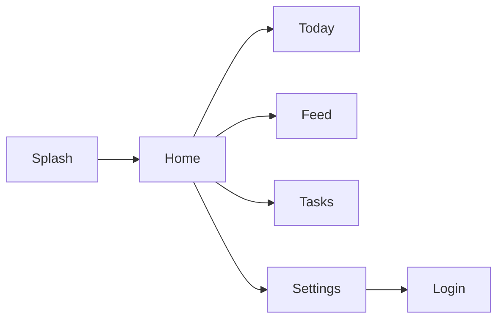
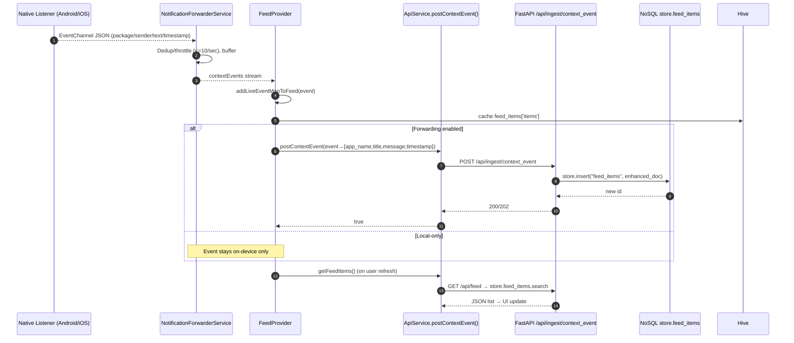
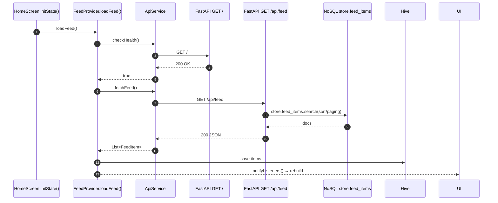

# Frontend Architecture Report (Flutter)

This document describes the current Flutter frontend located at `flutter_application_1/`. It connects to the FastAPI backend which now uses a Hive-like NoSQL store (`store.feed_items`, `store.connectors`). This report reflects the real implementation in the Flutter codebase and how it communicates with the active backend endpoints (WhatsApp + Notification ingestion and generic feed APIs).

---

## App Overview

- Purpose: A personal feed aggregator application that pulls user content (notably WhatsApp and notification-derived items) from the backend, performs task extraction, and displays a personalized feed in a modern UI.
- Primary features:
  - Fetch and display a feed of items with priority and relevance signals.
  - Ingest context events/notifications into the backend.
  - Live notifications surface within the UI via a native event channel.
  - Manage connectors (enable/disable) for WhatsApp (and other connectors as UI stubs).
  - Local persistence of feed and settings using Hive.
- Key packages (inferred from code imports):
  - http
  - provider
  - hive_flutter
  - shared_preferences
  - url_launcher
  - flutter_animate
  - phosphor_flutter (icons)
  - intl (date formatting)
  - glassmorphism (UI effect)

- Main structure:
  - `lib/main.dart` (app entry, routes, providers)
  - `lib/services/` (`api_service.dart`, `auth_service.dart`, `notification_forwarder.dart`, `local_storage.dart`)
  - `lib/models/` (`feed_item.dart`, `task.dart`, `user_profile.dart`)
  - `lib/providers/` (`FeedProvider`, `TaskProvider`, `UserProvider`)
  - `lib/screens/` (Home, Feed, Today, Tasks, Login/Connector Setup, Settings, Onboarding, etc.)
  - `lib/widgets/` (FeedCard, TaskCard, LiveNotificationsContainer, etc.)
  - `lib/config/api_config.dart` (API base URL and headers)

---

## Navigation and Screen Flow

- Routing setup: `MaterialApp.routes` in `lib/main.dart`:
  - `/splash` → `SplashScreen`
  - `/` → `HomeScreen`
  - `/onboarding` → `OnboardingScreen`
  - `/login` → `LoginScreen` (connector setup)
  - `/today` → `TodayScreen`
  - `/feed` → `FeedScreen`
  - `/tasks` → `TaskScreen`
  - `/settings` → `SettingsScreen`

- Providers initialized at root:
  - `FeedProvider`, `TaskProvider` (via `MultiProvider`)

- Screen flow examples:
  - Splash → (initialization) → Home
  - Home (dashboard) → Today (priorities) → Feed (full list) → Tasks
  - Settings → Login (manage connectors)

- Flow diagram (high-level):



---

## API Communication

- Base URL resolution: `lib/config/api_config.dart`
  - Respects `--dart-define=API_BASE_URL` or `LAN_IP` envs; defaults to LAN values.
  - `ApiConfig.baseUrl` returns an `.../api` URL (e.g., `http://192.168.29.143:8000/api`).
  - Headers: JSON content-type and accept.
  - Default timeout: 10s.

- Service: `lib/services/api_service.dart`
  - `checkHealth()`
    - GET `${baseUrl.replaceAll('/api','')}/`
    - Returns true on 200.
  - `fetchFeed()`
    - GET `${baseUrl}/feed`
    - Returns `List<FeedItem>` parsed from JSON array.
  - `getFeedItems({limit, offset, category, source, sortBy, sortOrder})`
    - GET `${baseUrl}/feed?limit=&offset=&...`
    - Returns `List<FeedItem>`.
  - `extractTasks(String text)`
    - POST `${baseUrl}/extract_tasks` with `{ "text": string }`
    - Returns `TaskExtractionResult`.
  - `postContextEvent(Map event)`
    - POST `${baseUrl}/ingest/context_event` with notification/context payload.
    - Returns boolean by status code (200 or 202 treated as success).
  - `postWhatsAppMessage(Map messageData)`
    - POST `${baseUrl}/whatsapp/add` with `{sender, message, timestamp(ms), user_id}`.
    - Returns boolean on success (200/202).

- Service: `lib/services/auth_service.dart` (Connector control)
  - Connector status: GET `${baseUrl}/{connector}/status?user_id=` (used for UI, includes WhatsApp)
  - Enable/disable connector: POST `${baseUrl}/{connector}/enable|disable` with `{ user_id }`
  - Gmail OAuth helpers exist but Gmail backend is paused; UI still shows stubs.

- Input/Output JSON mapping (selected):
  - Feed list item: server fields expected by `FeedItem.fromJson` (see Data Models)
  - Task extraction response: `{ summary: string, tasks: [ { verb, due_date?, text, ... } ] }`
  - WhatsApp add message: `{ sender: string, message: string, timestamp: int(ms), user_id: string }`
  - Ingest context event: conforms to backend `NotificationModel` (title/message/timestamp required by backend model)

- Error handling & retry:
  - Errors throw exceptions or set error message fields in providers/screens.
  - `FeedProvider` checks `checkHealth()` before fetching and sets `_errorMessage`.
  - Screens display retry buttons and snackbars on failure.

- Environment configuration:
  - `API_BASE_URL` and `LAN_IP` via `--dart-define`; otherwise LAN defaults in `ApiConfig`.

---

## Data Models

- `lib/models/feed_item.dart`
```dart
class FeedItem {
  final String id;
  final String title;
  final String summary;
  final String content;
  final DateTime date; // parsed from server "date"
  final String source;
  final int priority;
  final double relevance;
  final Map<String, dynamic>? metaData;

  factory FeedItem.fromJson(Map<String, dynamic> json) => FeedItem(
    id: json['id'],
    title: json['title'],
    summary: json['summary'],
    content: json['content'] ?? json['summary'],
    date: DateTime.parse(json['date']),
    source: json['source'],
    priority: json['priority'],
    relevance: (json['relevance'] ?? 0.0).toDouble(),
    metaData: json['metaData'],
  );
}
```
  - Mapping to backend NoSQL objects:
    - Backend may store similar fields under different keys (`summary`, `text`, `relevance` vs `relevance_score`, `metadata` vs `meta_data`). The Feed API adapts these on the server.

- `lib/models/task.dart`
  - `Task`, fields: `id`, `title`, `verb`, `dueDate?`, `text`, `priority (int)`, `isCompleted`, `completedAt?`, `createdAt`.
  - `TaskExtractionResult { summary, tasks[] }`.

- `lib/models/user_profile.dart`
  - Minimal structure: `userId`, `keywords[]`, `importantSenders[]` (not wired to backend in this app version).

---

## State Management

- `provider` with `ChangeNotifier` implementations:
  - `FeedProvider` (`lib/providers/feed_provider.dart`)
    - Holds `List<FeedItem>`, loading/health/error flags.
    - Loads from local Hive on init; `loadFeed()` fetches from backend and saves to Hive.
    - `addLiveEventMapToFeed()` injects native-captured events into feed.
  - `TaskProvider` (`lib/providers/task_provider.dart`)
    - Persists to Hive (`tasks` box). Add, toggle, remove operations update local store.
  - `UserProvider` placeholder.

- Reactive updates:
  - Providers `notifyListeners()` after changes; widgets use `Provider.of` to rebuild.

---

## UI Components

- Reusable widgets:
  - `FeedCard` (`lib/widgets/feed_card.dart`)
    - Displays source, time, title, summary, priority/relevance chips.
    - Animated press state, glassmorphism styling.
  - `TaskCard` (`lib/widgets/task_card.dart`)
    - Displays task details, completion toggle, metadata, action buttons (sync/delete).
  - `LiveNotificationsContainer` (`lib/widgets/live_notifications_container.dart`)
    - Subscribes to native `NotificationForwarderService.contextEvents` and shows recent live items.
  - Others: `context_event_tile.dart`, `loading_widget.dart`, `filter_chip.dart`, `priority_chip.dart`.

- Theming:
  - Defined in `lib/app.dart` and `lib/theme.dart` (Material 3); both dark and light themes with custom colors.

- Error UI:
  - Snackbars (e.g., in Home/Today/Settings/Login).
  - Empty/error states with icons and retry buttons (Feed/Today/Tasks).

---

## Local Storage / Caching

- `lib/services/local_storage.dart` with Hive:
  - Boxes opened: `incoming_events`, `feed_items`, `settings`, `tasks`.
  - `FeedProvider` caches feed (`feed_items['items']`).
  - `TaskProvider` stores tasks list.
  - `SettingsCaptureScreen` mirrors capture settings to Hive `settings` box.

- Cache refresh:
  - Feed re-fetched via pull-to-refresh or navigation actions; cache overwritten.

---

## Integration with Backend

- Periodic/real-time flow:
  - Live notifications are captured via native channels (Android/iOS bridges exposed by `NotificationForwarderService`) and can be forwarded server-side via backend settings (outside Flutter; Flutter toggles and displays data).
  - Feed is fetched on app load/refresh; WhatsApp and notification-derived items appear when backend creates them in `store.feed_items` and serves through the Feed API.

- Endpoints used:
  - Feed: `GET /api/feed` and variations with query params.
  - Notifications ingestion: `POST /api/ingest/context_event`.
  - WhatsApp ingestion: `POST /api/whatsapp/add`.
  - Connector status and toggles (WhatsApp): `GET/POST /api/whatsapp/status|enable|disable`.

- Display mapping:
  - `FeedItem.fromJson` expects keys (`id`, `title`, `summary`, `content/date/source/priority/relevance/metaData`). Backend serializes accordingly.

---

## Error Handling & Logging

- Network/API errors:
  - Exceptions caught in providers/screens; user feedback via snackbars and inline error panels.
  - Health check performed before feed fetch; message shown if backend is unreachable.

- Logging:
  - Console prints in services/providers for debug (e.g., ApiConfig.printConfig, response logs, FeedProvider logs).

---

## Testing & Build

- Tests (Flutter): `flutter_application_1/test/` directory exists (3 files). Not central to app logic in current code snapshot.
- Build configuration:
  - `pubspec.yaml` manages dependencies.
  - `analysis_options.yaml` for lints.
  - `Dockerfile` and `nginx.conf` present for deployment setups.
- Platform-specific:
  - `NotificationForwarderService` uses `EventChannel('com.yourorg.personalizedai/context_events')` and `MethodChannel('com.yourorg.personalizedai/settings')`. Corresponding native Android/iOS code must implement these channels for capturing/forwarding notifications. Permissions and manifests are handled in native projects (outside the Dart code shown).

---

## Configuration & Setup

- Environment variables:
  - `API_BASE_URL` (via `--dart-define`) to override backend base URL.
  - `LAN_IP` (via `--dart-define`) as alternative.
- Running locally:
  1. Ensure backend is running and reachable on LAN or emulator host.
  2. Start Flutter app with appropriate `--dart-define` (optional):
     - `flutter run --dart-define=API_BASE_URL=http://10.0.2.2:8000/api`
  3. On first launch, grant Notification and (optionally) Accessibility permissions from Settings.

---

## Known Limitations / Future Work

- Gmail connector UI exists but backend Gmail routes are paused.
- Tasks feature is primarily local; backend task APIs are TODO in `TaskScreen`.
- Some models and fields are simplified; backend may adapt keys (`relevance` vs `relevance_score`, `metaData` vs `metadata`).
- Native channel implementations (Android/iOS) must be completed for live capture.

---

## Examples

- Example request/response cycle (Feed):
  1. `FeedProvider.loadFeed()` → `ApiService.checkHealth()` → `ApiService.fetchFeed()`
  2. Parse `List<dynamic>` → `List<FeedItem>` via `FeedItem.fromJson`
  3. Store into Hive; UI displays `FeedCard` list

```json
// Sample feed item (server response shape adapted by backend)
{
  "id": 120,
  "title": "WhatsApp: Alice Johnson",
  "summary": "Meeting tomorrow at 2 PM...",
  "content": "Hey, can you review the proposal by tomorrow?",
  "date": "2024-01-12T15:30:00Z",
  "source": "whatsapp_notification",
  "priority": 1,
  "relevance": 0.65,
  "metaData": { "sender": "Alice Johnson" }
}
```

- Example WhatsApp message ingestion:
```dart
await ApiService().postWhatsAppMessage({
  'sender': 'Alice',
  'message': 'Ping me at 5',
  'timestamp': DateTime.now().millisecondsSinceEpoch,
  'user_id': '1',
});
```

- Example context event ingestion:
```dart
await ApiService().postContextEvent({
  'app_name': 'com.whatsapp',
  'title': 'WhatsApp Message',
  'message': 'Meeting at 2 PM',
  'timestamp': DateTime.now().toIso8601String(),
});
```

- Example model usage in UI:
```dart
FeedCard(
  feedItem: item,
  onTap: () {
    // show details dialog
  },
  showPriority: true,
  showRelevance: true,
)
```

---

## Flutter ↔ Backend Interaction Flow

### WhatsApp Message Ingestion (Sequence)

```mermaid
sequenceDiagram
  autonumber
  participant U as User
  participant FS as FeedScreen/Any UI
  participant AS as ApiService.postWhatsAppMessage()
  participant BE as FastAPI /api/whatsapp/add
  participant SV as services.whatsapp_connector (backend)
  participant NS as NoSQL store.feed_items

  U->>FS: Share/export WhatsApp message
  FS->>AS: postWhatsAppMessage({sender,message,timestamp,user_id})
  AS->>BE: POST /api/whatsapp/add (JSON)
  BE->>SV: Validate, summarize, extract tasks
  Note over BE,SV: Backend uses NoSQL (Hive-like); no SQLAlchemy
  SV->>NS: store.insert("feed_items", doc)
  NS-->>SV: inserted id
  SV-->>BE: OK (200/202) with feed item id
  BE-->>AS: 200/202
  AS-->>FS: true
  FS->>AS: getFeedItems() (optional refresh)
  AS->>BE: GET /api/feed
  BE->>NS: store.feed_items.search(filters)
  NS-->>BE: documents
  BE-->>AS: 200 JSON list
  AS-->>FS: List<FeedItem>
  FS->>UI: Rebuild list (FeedCard)
```

#### Explanation
- UI calls `ApiService.postWhatsAppMessage()` with `{ sender, message, timestamp(ms), user_id }`.
- Backend route `/api/whatsapp/add` processes via `services.whatsapp_connector` (summarization/tasks), then `store.insert("feed_items", ...)`.
- Success (200/202) lets UI optionally refresh via `getFeedItems()`.
- All persistence is in NoSQL; no `db.session` or SQLAlchemy. Errors (e.g., validation failure) return non-2xx; `ApiService` returns `false` and UI can show a snackbar.

---

### Notification Ingestion (Sequence)



#### Explanation
- `NotificationForwarderService` normalizes fields and throttles to 10 events/sec, dedupes recent keys for 5s.
- If user enables server forwarding, UI calls `postContextEvent()` to `/api/ingest/context_event`, and backend persists via `store.insert("feed_items", ...)`.
- UI always remains responsive due to Streams; backend sync is async (Futures/await in Dart and FastAPI handlers).
- Errors from POST return `false`; UI can keep showing local live tiles and optionally show a toast/snackbar.

---

### Health Check and Feed Fetch (Sequence)



#### Explanation
- `HomeScreen` triggers `FeedProvider.loadFeed()` on first frame.
- `checkHealth()` targets backend root (`/`) then `fetchFeed()` hits `/api/feed` if healthy.
- Backend reads from NoSQL using `store.feed_items.search(...)` (no SQLAlchemy), serializes DTOs, returns JSON.
- `FeedProvider` caches to Hive and updates the UI. Errors set `_errorMessage` and render retry UI.

---

### Components Overview (Component Diagram)

```mermaid
flowchart LR
  subgraph Flutter
    AS[ApiService]
    AuS[AuthService]
    NFS[NotificationForwarderService]
    FP[FeedProvider]
    UI[Home/Feed/Today/Tasks/Settings]
  end

  subgraph FastAPI Backend
    R1[/GET \//]
    R2[/GET /api/feed/]
    R3[/POST /api/ingest/context_event/]
    R4[/POST /api/whatsapp/add/]
    R5[/GET/POST /api/whatsapp/status|enable|disable/]
    SVC[Services (whatsapp_connector, notification_service)]
  end

  subgraph NoSQL Store
    C1[(store.connectors)]
    C2[(store.feed_items)]
  end

  UI --> FP
  FP --> AS
  NFS --> UI
  AuS --> R5

  AS --> R1
  AS --> R2
  AS --> R3
  AS --> R4

  R2 --> SVC
  R3 --> SVC
  R4 --> SVC
  R5 --> SVC

  SVC --> C2
  SVC --> C1
```

#### Explanation
- Flutter modules call backend routes via `ApiService`/`AuthService`.
- Backend services handle validation, enrichment, and interact with `store.feed_items` and `store.connectors` via `store.search()`, `store.insert()`, `store.upsert()`.
- No SQLAlchemy is involved; storage is the Hive-like in-memory/persistent NoSQL.

---

### Data Flow Summary

- Timing
  - **Frontend call**: `Future`-based HTTP via `http` package with 10s timeout.
  - **Backend compute**: Request handling + enrichment (e.g., summarization/tasks) in FastAPI services.
  - **Store access**: `store.search()/insert()/upsert()` are synchronous operations on the NoSQL store (memory-backed in tests; persistent otherwise).
  - **UI update**: Providers call `notifyListeners()`; widgets rebuild. Live notifications arrive via Streams.

- Caching / Debounce / Retry
  - **Caching**: `FeedProvider` caches feed in Hive (`feed_items['items']`). `TaskProvider` stores tasks locally.
  - **Throttle/Dedupe**: `NotificationForwarderService` enforces 10 events/sec and 5s key-based dedupe to avoid spam.
  - **Retry**: Manual via pull-to-refresh/buttons. No automatic exponential backoff in current Flutter code.
  - **Health gate**: `checkHealth()` before fetching feed to reduce noisy errors when backend is down.

---
