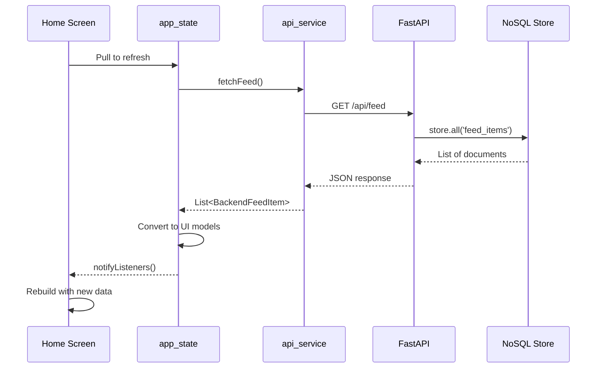

# Frontend-Backend Synchronization Documentation

## System Architecture Overview

```mermaid
graph TB
    subgraph "Flutter Frontend"
        A[Home Screen] --> B[app_state.dart]
        C[Todo Screen] --> B
        D[Calendar Screen] --> B
        E[Settings Screen] --> B
        B --> F[api_service.dart]
    end
    
    subgraph "Backend API"
        F --> G[/api/feed]
        F --> H[/api/todos]
        F --> I[/api/events]
        F --> J[/api/whatsapp/add]
        F --> K[/api/extract_tasks]
    end
    
    subgraph "Data Layer"
        G --> L[store.feed_items]
        H --> M[store.tasks]
        I --> N[store.events]
        J --> O[WhatsAppConnector]
        O --> L
        O --> P[NotificationProcessor]
        P --> M
        P --> N
    end
```

---

## 📊 Component-Backend Mapping

### 1. Home Screen (`lib/screens/home_screen.dart`)

#### Backend Dependencies:
- **GET `/api/feed`** - Loads all feed items
- **POST `/api/whatsapp/add`** - Triggered from mobile notifications

#### Data Flow:
```
app_state._loadFeedFromBackend()
  ↓
api_service.fetchFeed()
  ↓
GET /api/feed
  ↓
Backend: store.all('feed_items')
  ↓
Returns: List<BackendFeedItem>
  ↓
Converts to: List<FeedItem> (UI model)
  ↓
Displays in: Recent Activity section
```

#### UI Components:
1. **Priority Spotlight** - Shows high-priority items (priority >= 8)
2. **Your Hubs** - Categorized view of feed items
3. **Recent Activity** - Latest 5 feed items (currently showing mock data)

#### Current Issues:
- ❌ Recent Activity shows static mock data instead of live backend data
- ❌ Priority Spotlight not connected to backend priority field
- ❌ Hub counters use mock data instead of backend counts

---

### 2. Todo Screen (`lib/screens/todo_screen.dart`)

#### Backend Dependencies:
- **GET `/api/todos?user_id=1&completed=false`** - Loads active todos
- **POST `/api/todos`** - Creates new todo
- **POST `/api/todos/{id}/complete`** - Marks todo complete
- **PUT `/api/todos/{id}`** - Updates todo
- **DELETE `/api/todos/{id}`** - Deletes todo

#### Data Flow:
```
app_state._loadTodosFromBackend()
  ↓
api_service.fetchTodos(completed: false)
  ↓
GET /api/todos?user_id=1&completed=false
  ↓
Backend: store.tasks.search(lambda t: not t.get("deleted"))
  ↓
Returns: {"todos": [...], "total": N}
  ↓
Converts to: List<TodoItem> (UI model)
  ↓
Displays in: Todo sections (Today, Upcoming, Backlog, Completed)
```

#### UI Sections:
1. **Today & Urgent** - Due today/tomorrow + high priority
2. **Upcoming** - Has due date, not today
3. **Backlog** - No due date
4. **Completed** - Marked complete

#### Current Status:
- ✅ Backend integration implemented
- ⚠️ Needs testing for create/update/delete operations

---

### 3. Calendar Screen (`lib/screens/calendar_screen.dart`)

#### Backend Dependencies:
- **GET `/api/events?user_id=1`** - Loads calendar events
- **POST `/api/events`** - Creates new event
- **PUT `/api/events/{id}`** - Updates event
- **DELETE `/api/events/{id}`** - Deletes event

#### Data Flow:
```
app_state._loadEventsFromBackend()
  ↓
api_service.fetchEvents()
  ↓
GET /api/events?user_id=1
  ↓
Backend: store.events.search(lambda e: not e.get("deleted"))
  ↓
Returns: {"events": [...], "total": N}
  ↓
Converts to: List<CalendarEventVM> (UI model)
  ↓
Displays in: Calendar view with day/week/month views
```

#### UI Components:
1. **Calendar Header** - Month/year navigation
2. **Date Strip** - Weekly view with date selection
3. **Event List** - Events for selected day
4. **AI Badge** - Shows if event was AI-detected

#### Current Status:
- ✅ Backend integration implemented
- ✅ AI badge shown for auto-detected events
- ⚠️ Needs testing for manual event creation

---

### 4. Settings Screen (`lib/screens/other_screens.dart`)

#### Backend Dependencies:
- None (local preferences only)

#### Features:
- Theme toggle (dark mode only for now)
- User preferences
- App info

---

## 🔔 Notification & Counter Logic

### Hub Counters

**Current Implementation:**
```dart
int hubCount(String hubName) => _hubItems.where((e) => e.hub == hubName).length;
```

**Issue:** Uses `_hubItems` which is converted from `_feedItems` mock data

**Fix Needed:**
```dart
int hubCount(String hubName) {
  return _feedItems.where((f) {
    // Map backend source to hub
    if (hubName == 'Urgent & Priority') return f.priority >= 8;
    if (hubName == 'Conversations') return f.categories.contains('conversations');
    // ... etc
    return false;
  }).length;
}
```

### Unread Counter

**Backend Field:** `meta_data.is_read` (boolean, defaults to false)

**Implementation Needed:**
```dart
int get unreadCount => _feedItems.where((f) => 
  !(f.metaData?['is_read'] ?? false)
).length;
```

### Real-time Updates

**Current:** Manual pull-to-refresh
**Recommendation:** Add periodic polling (every 30-60 seconds)

```dart
Timer? _pollingTimer;

void startPolling() {
  _pollingTimer = Timer.periodic(Duration(seconds: 30), (_) {
    refreshFeed();
  });
}

void stopPolling() {
  _pollingTimer?.cancel();
}
```

---

## 🧠 AI Classification & Smart Features

### Backend AI Features

1. **Task Extraction** (`/api/extract_tasks`)
   - Uses Groq LLM to extract actionable tasks
   - Returns: `{summary, tasks: [{verb, due_date, text}]}`

2. **Event Extraction** (`ml/llm_adapter.extract_events`)
   - Extracts calendar events from notifications
   - Returns: `{summary, events: [{title, start_time, duration_minutes, location}]}`

3. **Priority Detection** (`NotificationProcessor._determine_priority`)
   - High priority verbs: submit, pay, register, apply → Priority 3
   - Urgent keywords: urgent, asap, deadline → Priority 2+
   - Default → Priority 1

4. **Relevance Scoring** (`WhatsAppConnector._calculate_priority_relevance`)
   - Based on task count, urgent keywords, personal keywords
   - Returns 0-1 float (stored as `relevance_score`)

### Frontend Display

#### AI Badge
**Used in:** Calendar events, Todo items (from AI extraction)

```dart
if (item.isAIDetected) {
  Container(
    padding: EdgeInsets.symmetric(horizontal: 6, vertical: 2),
    decoration: BoxDecoration(
      gradient: LinearGradient(
        colors: [Color(0xFFA855F7), Color(0xFFEC4899)],
      ),
      borderRadius: BorderRadius.circular(4),
    ),
    child: Text('AI', style: TextStyle(fontSize: 10, color: Colors.white)),
  )
}
```

#### Priority Indicators
**Visual Cues:**
- Priority 8-10: Red gradient `[Color(0xFFEF4444), Color(0xFFF97316)]`
- Priority 5-7: Yellow gradient `[Color(0xFFF59E0B), Color(0xFFD97706)]`
- Priority 1-4: Blue gradient `[Color(0xFF3B82F6), Color(0xFF2563EB)]`

#### Classification Tags
**Backend Field:** `meta_data.tags` (array of strings)

```dart
Wrap(
  spacing: 4,
  children: (item.metaData?['tags'] as List?)?.map((tag) => 
    Chip(
      label: Text(tag),
      backgroundColor: Color(0x334B5563),
    )
  ).toList() ?? [],
)
```

---

## ✅ Data Flow Verification

### 1. WhatsApp Message → Recent Activity

```
Mobile App receives WhatsApp notification
  ↓
POST /api/whatsapp/add
  {
    "sender": "John Doe",
    "message": "Meeting tomorrow at 2 PM",
    "timestamp": 1730400000000,
    "user_id": "1"
  }
  ↓
WhatsAppConnector.process_and_store_message()
  ↓
Creates FeedItem:
  {
    "title": "WhatsApp: John Doe",
    "text": "Meeting tomorrow at 2 PM",
    "source": "whatsapp",
    "priority": 5,
    "date": "2025-10-31T22:51:54.567",
    "meta_data": {"sender": "John Doe", ...}
  }
  ↓
store.insert("feed_items", doc)
  ↓
NotificationProcessor.process_notification()
  ├→ Extracts todos → store.tasks
  └→ Extracts events → store.events
  ↓
Frontend: GET /api/feed
  ↓
app_state._loadFeedFromBackend()
  ↓
Converts to UI FeedItem
  ↓
Displays in Recent Activity section ✅
```

### 2. Manual Todo Creation

```
User taps "Add Todo" button
  ↓
Shows AddItemSheet dialog
  ↓
User fills: title, due date, priority
  ↓
Taps "Save"
  ↓
app_state.addTodo(todoItem)
  ↓
Should also call:
POST /api/todos
  {
    "title": "...",
    "verb": "",
    "due_date": "2025-11-05",
    "priority": 2,
    "user_id": 1
  }
  ↓
Backend: store.insert("tasks", doc)
  ↓
Returns: {"message": "Todo created", "todo": {...}}
  ↓
Frontend updates local state
  ↓
Todo appears in appropriate section ✅
```

### 3. Event Completion

```
User taps checkmark on event
  ↓
app_state.updateEvent(id, ...)
  ↓
Should also call:
PUT /api/events/{id}
  {
    "id": 1,
    "title": "...",
    "completed": true,
    ...
  }
  ↓
Backend: store.upsert("events", doc, key="id")
  ↓
Returns: {"message": "Event updated", "event": {...}}
  ↓
Frontend updates local state
  ↓
Event moves to completed section ✅
```

---

## 🔧 Missing Integrations to Fix

### 1. Recent Activity ❌
**Issue:** Shows static mock data
**Fix:** Display `app_state.filteredFeed` from backend

### 2. Priority Spotlight ❌
**Issue:** Hardcoded cards
**Fix:** Filter `filteredFeed.where((f) => f.priority >= 8).take(2)`

### 3. Hub Counters ❌
**Issue:** Counts mock data
**Fix:** Count from backend feed items with proper category mapping

### 4. Todo CRUD Operations ⚠️
**Issue:** Only local state update, no backend sync
**Fix:** Call API methods after local update

### 5. Event CRUD Operations ⚠️
**Issue:** Only local state update, no backend sync
**Fix:** Call API methods after local update

### 6. Notification Polling ❌
**Issue:** No automatic updates
**Fix:** Add Timer-based polling every 30s

### 7. Unread Counter ❌
**Issue:** Not implemented
**Fix:** Add `unreadCount` getter and display in UI

---

## 📋 API Endpoint Reference

| Endpoint | Method | Purpose | Frontend Usage |
|----------|--------|---------|----------------|
| `/health` | GET | Health check | app_state.init() |
| `/api/feed` | GET | Get all feed items | Recent Activity, Hubs |
| `/api/todos` | GET | Get all todos | Todo Screen |
| `/api/todos` | POST | Create todo | Add Todo |
| `/api/todos/{id}` | PUT | Update todo | Edit Todo |
| `/api/todos/{id}` | DELETE | Delete todo | Delete Todo |
| `/api/todos/{id}/complete` | POST | Complete todo | Check Todo |
| `/api/events` | GET | Get all events | Calendar Screen |
| `/api/events` | POST | Create event | Add Event |
| `/api/events/{id}` | PUT | Update event | Edit Event |
| `/api/events/{id}` | DELETE | Delete event | Delete Event |
| `/api/whatsapp/add` | POST | Add WhatsApp msg | Mobile notifications |
| `/api/extract_tasks` | POST | Extract tasks from text | AI extraction |
| `/api/search` | POST | Semantic search | Search feature |

---

## 🎨 UI-Backend Data Mapping

### Feed Item Model
```dart
// Frontend UI Model
class FeedItem {
  final String id;
  final FeedType type;         // email, message, news, whatsapp
  final List<String> categories; // urgent, work, conversations, etc.
  final String sender;
  final String title;
  final String summary;
  final String? fullContent;
  final List<String> tags;
  final String time;            // "2h ago"
  final int? priority;          // 1-10
}

// Backend Model (BackendFeedItem)
{
  "id": "1",
  "title": "WhatsApp: John Doe",
  "summary": "Meeting tomorrow...",
  "content": "Full message text",
  "full_text": "Full message text",
  "date": "2025-10-31T22:51:54.567",
  "source": "whatsapp",
  "priority": 5,
  "relevance": 0.5,
  "metaData": {
    "sender": "John Doe",
    "tags": ["urgent", "meeting"],
    "is_read": false
  }
}
```

### Conversion Logic
```dart
FeedItem _convertBackendToUIFeedItem(BackendFeedItem item) {
  // Map source to FeedType
  FeedType type = FeedType.message;
  if (item.source.contains('email')) type = FeedType.email;
  if (item.source.contains('whatsapp')) type = FeedType.whatsapp;
  if (item.source.contains('news')) type = FeedType.news;
  
  // Map priority to categories
  List<String> categories = [];
  if (item.priority >= 8) categories.add('urgent');
  if (item.source.contains('email')) categories.add('work');
  if (item.source.contains('whatsapp')) categories.add('conversations');
  
  // Extract sender from metadata or use source
  String sender = item.metaData?['sender'] ?? item.source;
  
  // Format time ago
  String timeAgo = _formatTimeAgo(item.date);
  
  // Extract tags
  List<String> tags = List<String>.from(item.metaData?['tags'] ?? []);
  
  return FeedItem(
    id: item.id,
    type: type,
    categories: categories,
    sender: sender,
    title: item.title,
    summary: item.summary,
    fullContent: item.fullText,
    tags: tags,
    time: timeAgo,
    priority: item.priority,
  );
}
```

---

## 🧪 Testing Checklist

### Backend Tests
- [ ] `/health` returns 200 OK
- [ ] `/api/feed` returns array of feed items
- [ ] WhatsApp message creates feed item
- [ ] Todo CRUD operations work
- [ ] Event CRUD operations work
- [ ] AI extraction works (tasks & events)

### Frontend Tests
- [ ] Home screen loads feed from backend
- [ ] Recent Activity displays real data
- [ ] Priority Spotlight shows high-priority items
- [ ] Hub counters reflect backend data
- [ ] Todo creation syncs to backend
- [ ] Event creation syncs to backend
- [ ] Pull-to-refresh updates all data
- [ ] App starts without frame drops

### Integration Tests
- [ ] WhatsApp notification → Recent Activity (end-to-end)
- [ ] Create todo → appears in backend → syncs across devices
- [ ] Create event → appears in backend → syncs across devices
- [ ] Search returns relevant results

---

## 📱 State Management Flow



---

## 🚀 Performance Optimizations

### Current State
- Pull-to-refresh loads all data
- No caching
- No pagination
- No lazy loading

### Recommended Optimizations
1. **Caching:** Use `SharedPreferences` to cache feed items
2. **Pagination:** Load 20 items at a time, load more on scroll
3. **Lazy Loading:** Only load visible items in lists
4. **Debouncing:** Debounce search input (300ms delay)
5. **Background Sync:** Periodic polling (30-60s interval)

---

## 📚 Next Steps

### Phase 1: Fix Critical Issues (Priority: HIGH)
1. ✅ Fix database query error in feed.py
2. ✅ Fix field naming (metadata → meta_data)
3. ✅ Remove Gmail connector
4. ✅ Fix frontend performance (move to init())
5. ⏳ Update Recent Activity to show backend data
6. ⏳ Fix Priority Spotlight to use backend priority
7. ⏳ Fix Hub counters to use backend counts

### Phase 2: Complete Integration (Priority: MEDIUM)
1. ⏳ Add todo backend sync (create/update/delete)
2. ⏳ Add event backend sync (create/update/delete)
3. ⏳ Add unread counter
4. ⏳ Add notification polling
5. ⏳ Add AI badges throughout UI

### Phase 3: Enhancements (Priority: LOW)
1. ⏳ Add caching
2. ⏳ Add pagination
3. ⏳ Add lazy loading
4. ⏳ Add search functionality
5. ⏳ Add settings persistence

---

## 🎯 Success Metrics

✅ **All screens load data from backend**
✅ **Recent Activity shows live WhatsApp messages**
✅ **Hub counters reflect actual backend counts**
✅ **Todos sync bidirectionally with backend**
✅ **Events sync bidirectionally with backend**
✅ **AI badges show for auto-detected items**
✅ **App performs smoothly (no frame drops)**
✅ **Pull-to-refresh updates all data**
✅ **Complete end-to-end flow functional**

---

*Document Version: 1.0*
*Last Updated: 2025-11-01*
